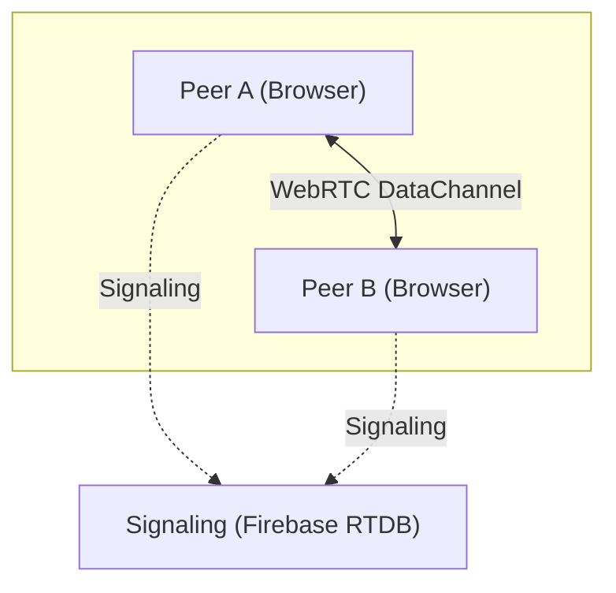
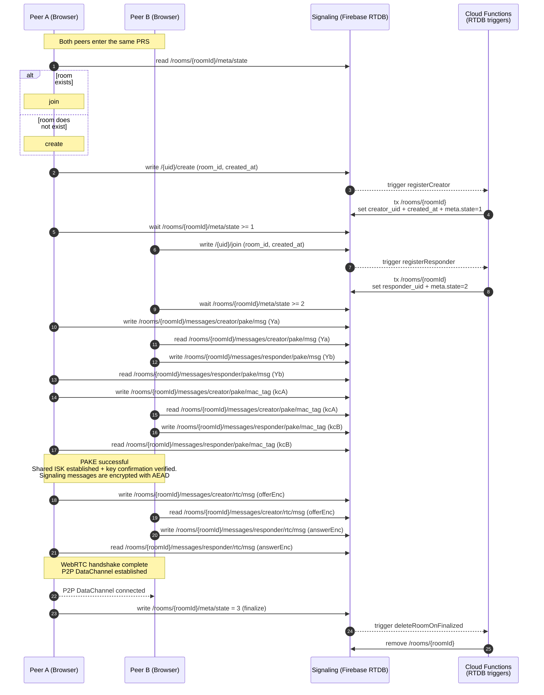

# PeachShare — P2P file exchange

- **WebRTC DataChannel** for direct P2P transport (file + control protocol)
- **Firebase Realtime Database** as signaling + rendezvous (no payload storage)
- **PAKE (CPace)** to derive a shared session key from a human-entered PRS
- **Room ID derivation**: PRS + drand-based OTP → Argon2id → roomId (base64url)

## Diagrams
HLA


WebRTC Datachannel


## Security Model

PeachShare treats **Firebase RTDB as an untrusted signaling plane**. It must not learn plaintext signaling, file contents, or the PRS.

### Trust boundaries
- **Trusted**: the two participating browsers (Peer A/B).
- **Untrusted / semi-trusted**: Firebase RTDB + Cloud Functions (can observe metadata; may attempt tampering).

### Room ID derivation (anti-enumeration)
Users enter a short **PRS** (e.g. `\d{6}`), but the room identifier is **memory-hard derived** and changes with time:

- `roomId = Argon2id(password = PRS, salt = drand_digest)`
- Params: `memory=64 MiB`, `passes=3`, `parallelism=1`, `tagLen=32 bytes`
- Salt is fetched from **drand** (round period ~30s). The client tries **three rounds** `r, r-1, r-2` (≈90s tolerance) and prioritizes the current round.

**Why:** prevents building a static “directory of rooms”. Enumeration requires recomputing candidates every drand round.

**Rough brute-force cost (6-digit PRS):**
- 1,000,000 candidates per ~30s round → ≈ **33,333 Argon2id/sec**
- If 1 hash takes **50–100 ms**, that’s **~1,667–3,333 CPU-cores** sustained
- Memory pressure (one worker per core, 64 MiB): **~104–208 GiB RAM**

### Key establishment (PAKE + key confirmation)
Peers derive a shared session key using **CPace (PAKE)** from the PRS. To detect active tampering / unknown-key-share, the protocol performs explicit key confirmation:

- `macKey = SHA-512("CPaceMac" || sid || ISK)`
- Tags: `kcA = HMAC-SHA256(macKey, Ya)`, `kcB = HMAC-SHA256(macKey, Yb)`
- Verification is constant-time; the session aborts on mismatch.

### Encrypted signaling in RTDB (offer/answer)
WebRTC signaling payloads are stored as **opaque ciphertext**:

- `key = HKDF-SHA256(isk, salt="rooms:webrtc-signal-key:v1:<roomId>", info="webrtc-signal:gcmsiv", len=32)`
- AEAD: **AES-GCM-SIV** with managed nonce
- AAD binds ciphertext to room + field: `aad="rooms:webrtc-signal-aad:v1:<roomId>:<offer|answer>"`

Result: RTDB cannot read signaling; modifications are detected (AEAD authentication), and messages cannot be swapped across rooms/fields (AAD binding).

### Authorization + orchestration (rules + triggers)
RTDB rules are **deny-by-default** and enforce strict roles and sequencing:

- Clients do not create/join rooms by writing `/rooms/*` directly. They write per-user slots:
  - `/{uid}/create`, `/{uid}/join` (owner-only; time-bounded; **~10s cooldown** per slot update)
- Cloud Functions triggers perform atomic transactions to register participants:
  - set `private.creator_uid` / `private.responder_uid` and `meta.state` (`1 → 2`)
- Room access is participant-scoped:
  - only `creator_uid` or `responder_uid` can read room messages under `/rooms/{roomId}/messages/**`
  - protocol fields are **role-partitioned**: the creator writes only `/messages/creator/**`, the responder writes only `/messages/responder/**`
  - messages are **write-once** (append-only semantics per field; no overwrites)
- Finalization: `meta.state = 3` is allowed only after all required protocol messages exist; a trigger then **deletes the room**.

### Security properties (what this design gives you)
- Confidentiality/integrity of WebRTC offer/answer in RTDB (AEAD under keys derived from ISK)
- Strong resistance to room enumeration via time-rotating drand salt + memory-hard Argon2id KDF
- Reduced online guessing/DDoS via slot rate limiting + ephemeral rooms (deleted on finalize)
- Only registered participants can read room messages; non-members can’t observe transcripts

### Limitations
- Backend can observe metadata (timing, sizes, access patterns, room existence attempts)
- Security depends on PRS entropy and the integrity of the client environment
- **First-writer wins** for role assignment: creator/responder are assigned once by triggers; in a race, the role is taken by the first successfully processed slot/transaction

## Application Protocol

WebRTC DataChannel gives a low-level byte transport, but it does not solve product-level concerns needed for file exchange: framing, control messages, progress reporting, backpressure, cancellation, "download to sink", and a consistent error model. PeachShare implements a dedicated application protocol for a browser-only, session-scoped P2P exchange.

### Transport abstraction

The protocol is built on a minimal duplex primitive:

```ts
export interface P2pChannel {
  readable: ReadableStream<Uint8Array>;
  writable: WritableStream<Uint8Array>;
  close(): void;
  onClose(cb: () => void): () => void;
}
```

This keeps the core protocol independent from WebRTC specifics and enables deterministic tests by swapping the transport.

### Protocol goals

* **Control + data planes** over a single channel (metadata/commands + binary transfer)
* **Streaming-first** transfers using **Web Streams** (no full-file buffering)
* **Backpressure-aware** pipelines to keep memory bounded
* **Composable downloads** via `requestDownloadTo(..., WritableStream)` (sink-based)
* **Operational clarity**: stable transfer IDs, progress events, terminal events, typed errors

### Session API (UI-facing)

UI integrates through a session facade that exposes state, file inventories, and transfer lifecycle:

```ts
export interface FileExchangeSession {
  state(): SessionState;
  onStateChanged(cb: (s: SessionState) => void): () => void;

  dispose(): void;

  addLocal(files: FileList | File[]): Promise<void>;
  unshare(fileId: string): void;

  localFiles(): readonly FileDesc[];
  onLocalFilesChanged(cb: (files: readonly FileDesc[]) => void): () => void;

  peerFiles(): readonly FileDesc[];
  onPeerFilesChanged(cb: (files: readonly FileDesc[]) => void): () => void;

  requestDownload(fileId: string): DownloadHandle;
  requestDownloadTo(fileId: string, sink: WritableStream<Uint8Array>): DownloadToSinkHandle;

  cancelTransfer(transferId: string): void;

  onTransferProgress(cb: (p: TransferProgress) => void): () => void;
  onTransferTerminal(cb: (event: TransferTerminalEvent) => void): () => void;
  onError(cb: (e: SessionError) => void): () => void;
}
```

`RoomSession` is a thin adapter over `FileExchangeSession` that binds protocol events to app state (files, transfers, status/notices) and enforces “read-only while connecting/error”.

### Flow control / backpressure

Transfers are implemented as stream pipelines:

* **Sender**: file stream → chunker → (transforms) → framed writer
* **Receiver**: framed reader → deframe → route by `transferId` → sink writer

Backpressure is enforced via the WritableStream contract (awaiting readiness/write completion), so the sender does not outpace the receiver.

### AI-assisted implementation note

Implementation was AI-assisted (scaffolding/wiring and iterative drafts), while the protocol requirements, constraints, public API, state model, and correctness criteria (backpressure, cancellation semantics, error model, integration boundaries, and tests) were defined and validated by me.

## Offline / local-first mode
PeachShare can be deployed locally (e.g., on a laptop) and used **offline** over a Wi-Fi access point (two devices on the same network, no Internet required).

```bash
pnpm docker:offline
# ...
pnpm docker:offline:down
```
## Developer Experience

### Quality gates
- **Type safety**: TypeScript `typecheck` in CI
- **Lint/format**: Biome (lint + formatter)

### Testing pyramid
- **Unit**: Vitest
- **Integration**: Testcontainers
- **E2E**: WebdriverIO

### CI/CD
- lint → typecheck → unit → integration → (deploy/release - manual workflow)

## Trade-offs

- **Cost/DDoS surface (cloud-triggered architecture)**  
  Room creation/join is mediated by RTDB writes + Cloud Functions triggers. This exposes a cost-amplification vector: an attacker can burn quotas (RTDB writes, function invocations, bandwidth, auth) even without achieving a successful session. There is no dedicated backend rate limiter or WAF.

- **Anonymous sign-in & botnets**  
  The project uses anonymous auth for frictionless onboarding. App Check + CAPTCHA reduce abuse, but a sufficiently resourced botnet can still generate load (and free-tier CAPTCHA limits can be exhausted). Direct Firebase API abuse remains a practical threat model for any public Firebase-backed app.

- **STUN-only WebRTC (no TURN fallback)**  
  Connectivity depends on NAT properties and firewall policies. In restrictive networks, peer-to-peer may fail without relay. Asymmetric behavior (e.g., "home → office fails, office → home works") is consistent with NAT/Firewall differences: one side may be behind a stricter NAT or outbound policy (symmetric NAT, UDP restrictions, or limited NAT hairpinning/endpoint mapping behavior), causing ICE to fail without TURN.

- **Dependency on drand availability**  
  Room ID derivation relies on drand rounds. If drand is unavailable (or latency is high), room discovery/creation is delayed or fails.

- **File size / memory constraints**  
  Current streaming uses `Blob`-backed reads and can materialize data in memory. To keep memory bounded on typical devices, the app enforces a **128 MiB** file size limit.

- **No retry/resume for session establishment**  
  The handshake is multi-step (room registration → PAKE → signaling → ICE/DataChannel). If any step breaks (network drop, tab reload), the current behavior is to restart the session; transfer resume/retry is not implemented yet.

## Potential Improvements

The project is currently at an MVP stage. The items below are optional enhancements rather than a committed roadmap.

- **TURN support** (relay fallback) to improve connectivity in restrictive NAT/firewall environments.
- **Directory transfer** (folder send) with stable metadata + structure preservation.
- **Pause/Resume transfers** (and optional chunk-level retry) for long downloads and flaky networks.
- **Stream directly to disk** to remove the current file size cap (e.g., via the browser’s File System Access API or stream-to-disk helpers such as StreamSaver-style approaches).
- **Session reuse research**: explore whether parts of the ICE/connection state can be cached or warmed up to reduce reconnection cost (subject to WebRTC constraints and entropy requirements).
- **QR pairing**: replace low-entropy PRS with high-entropy QR secrets; potentially embed enough bootstrap data to run fully offline (and/or reduce dependence on server-side signaling).
- **Protocol/codebase simplification**: reduce complexity of the application protocol implementation; evaluate reusing existing libraries/abstractions where it doesn’t compromise constraints (e.g., replacing `simple-peer` or exploring libp2p-style layers).
- **Security audit / external review**: independent review of crypto usage, rules, triggers, and abuse-resilience.